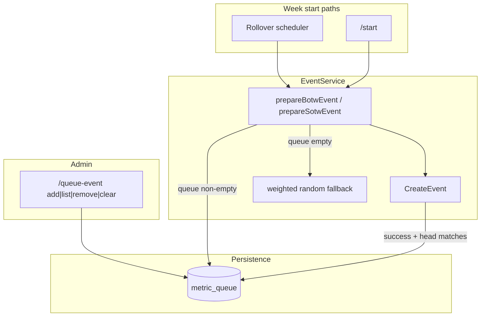

# feat: Competition metric queue (`/queue-event`)

## Summary

Add an admin-only `/queue-event` command so guilds can FIFO-queue BOTW bosses and SOTW skills for upcoming weeks. Week start (rollover or `/start`) consumes the queue head when present; empty queue keeps today's weighted-random **Metric Pool** selection.

## Problem Frame

Admins cannot reserve a specific **Competition Metric** for the next week. `/stop` + `/start` still randomizes. This plan completes partial BOTW queue work already in the repo and ships the full feature per the origin requirements doc.

---

## Requirements

Traceability to origin `R1`–`R13`, flows `F1`–`F3`, acceptance examples `AE1`–`AE5`.

- R1. `/queue-event` with subcommands `add`, `list`, `remove`, `clear` (origin R1, command name resolved in brainstorm).
- R2. Every subcommand takes `type`: BOTW or SOTW (origin R2).
- R3–R7. Add/list/remove/clear behavior and autocomplete validation (origin R3–R7).
- R8–R11. Queue-first selection at week start; consume only after successful event persist; random when empty; queued weeks enter **Recent Metric History** (origin R8–R11).
- R12–R13. Admin-only; per-guild persisted queue (origin R12–R13).
- R14. Guild log channel records queue mutations and notes when `/start` uses queued metrics (origin Key Decisions — admin visibility).
- R15. **Rollover Log** annotates each new week as `queued` or `random` (origin Key Decisions).

---

## Key Technical Decisions

- **KTD1 — Reuse partial `metric_queue` persistence:** Table and store methods already exist (`internal/database/sqlite_metric_queue.go`, `internal/database/store.go`). Finish tests and wire all consumers rather than redesigning storage. *(see origin: partial implementation note)*

- **KTD2 — Peek at prepare, pop after persist:** `prepareBotwEvent` / `prepareSotwEvent` peek the queue head (skipping stale entries). `CreateEvent` pops only when the persisted `MetricJsonID` matches the head — failed creates do not consume. BOTW already follows this pattern; extend to SOTW. *(origin R9)*

- **KTD3 — Shared metric resolution helpers:** Generalize `findBossConfig` / `pickQueuedBossConfig` into type-agnostic helpers (`findMetricInPool`, `pickQueuedMetric`) used by both BOTW and SOTW prepare paths and queue admin methods. Canonical metric names stored in queue come from remote config `Name` field.

- **KTD4 — First Discord subcommand group in repo:** No existing `ApplicationCommandOptionSubCommand` usage. Model `/queue-event` after admin command patterns in `internal/discord/cmd_start.go` (permissions, ephemeral responses, `logAction`) with subcommands for `add`/`list`/`remove`/`clear`. Autocomplete follows `internal/discord/cmd_submit_pb.go` pattern; add handler branch in `internal/discord/bot.go` `handleAutocomplete`.

- **KTD5 — Selection source on rollover only:** Extend `discord.RolloverResult` with a `Queued bool` (or `SelectionSource string`) set in `internal/scheduler/completion.go` when building `newEvents`. `SendRolloverCompleteLog` formats new weeks as e.g. `Boss of the Week: Maggot King (Week 42) — queued`. `/start` log (`SendCompetitionStartedLog`) gets the same annotation when applicable.

---

## High-Level Technical Design

**Stale entry handling:** Loop peek → validate against remote config → pop and retry until empty or valid head.

---

## Implementation Units

### U1. Persistence layer tests and mock completeness

**Goal:** Verify `metric_queue` CRUD and ensure all store fakes compile.

**Requirements:** R13

**Dependencies:** None

**Files:**
- `internal/database/sqlite_metric_queue.go` (existing — review only)
- `internal/database/sqlite_metric_queue_test.go` (new)
- `internal/discord/services/fake_store_test.go` (extend `fakeEventStore` with queue methods)
- `internal/scheduler/completion_test.go` (extend mock store if it implements `EventStore`)

**Approach:** Table-driven tests for append, list order, peek, pop FIFO, remove-at-position, clear, and empty-queue behavior using in-memory SQLite store pattern from `internal/database/sqlite_guilds_test.go`.

**Patterns to follow:** Existing SQLite store tests; transaction pop in `PopMetricQueue`.

**Test scenarios:**
- Append three entries → `ListMetricQueue` returns FIFO order
- `PopMetricQueue` removes oldest only
- `RemoveMetricQueueAt` position 2 removes middle entry
- `ClearMetricQueue` returns count removed
- Pop on empty queue returns empty string, no error

**Verification:** `go test ./internal/database/...` passes; project compiles with extended fakes.

---

### U2. EventService — SOTW queue parity and shared selection

**Goal:** Both competition types use the same queue-first selection and consume-on-persist semantics.

**Requirements:** R8–R11; Covers AE1–AE4

**Dependencies:** U1

**Files:**
- `internal/discord/services/event_queue.go` (refactor + SOTW methods)
- `internal/discord/services/event.go` (`prepareSotwEvent`, `CreateEvent` consume for SOTW)
- `internal/discord/services/event_test.go` (new queue selection tests)
- `internal/discord/services/store_interfaces.go` (already extended)

**Approach:**
- Refactor BOTW-specific queue helpers to accept `eventType` (`botw` / `sotw`).
- Add `AddSotwQueue`, `ListSotwQueue`, `RemoveSotwQueueAt`, `ClearSotwQueue`, `SkillNamesFromConfig` mirroring BOTW.
- In `prepareSotwEvent`, mirror BOTW queue peek / random fallback / logging branch.
- In `CreateEvent`, call consume helper for both `botw` and `sotw`.
- Return selection metadata from prepare (e.g. `fromQueue bool`) if needed for logging in U4.

**Patterns to follow:** Existing `prepareBotwEvent` queue branch in `event.go`; `weightedPickSkill` for random fallback.

**Test scenarios:**
- Covers AE1. Queue head used when preparing BOTW with queued boss in fake store + config
- Covers AE2. Empty queue → `weightedPickBoss` / random path (may use seeded random or inspect weight path)
- Covers AE3. Two consecutive `CreateEvent` cycles consume FIFO order
- Covers AE4. Stale head skipped; second entry selected
- `CreateEvent` failure (mock store error) does not pop queue

**Verification:** `go test ./internal/discord/services/...` passes for new cases.

---

### U3. Discord `/queue-event` command

**Goal:** Admin-facing queue management with autocomplete.

**Requirements:** R1–R7, R12, R14; Covers AE5, F1

**Dependencies:** U2

**Files:**
- `internal/discord/cmd_queue_event.go` (new)
- `internal/discord/commands.go` (register)
- `internal/discord/bot.go` (autocomplete handler for `queue-event`)
- `internal/discord/cmd_queue_event_test.go` (new — pure helpers if any)

**Approach:**
- Subcommand structure:
  - `add` — options: `type` (BOTW/SOTW choice), `metric` (string, autocomplete)
  - `list` — option: `type`
  - `remove` — options: `type`, `position` (integer, min 1)
  - `clear` — option: `type`
- Handler dispatches on subcommand name from `i.ApplicationCommandData().Options[0]`.
- Admin check via `hasAdminPermission` (same as `cmd_start.go`).
- Ephemeral success/error via `respondSuccess` / `respondError`.
- `add` calls `EventService.AddBotwQueue` / `AddSotwQueue`; confirm queue position in reply.
- `list` formats numbered list or "Queue is empty."
- Log channel: `logAction` on add/remove/clear (mirror `cmd_addpoints.go`).

**Patterns to follow:** `cmd_addpoints.go` (admin + options), `cmd_submit_pb.go` (autocomplete filtering), `cmd_start.go` (guild-only).

**Test scenarios:**
- Autocomplete filters boss/skill names by prefix (unit test helper)
- Unknown metric on add surfaces `ErrUnknownBoss` / skill equivalent as user-facing error
- Remove invalid position returns clear error (service error propagated)

**Verification:** Command registers on bot startup; manual smoke in Discord optional.

---

### U4. Rollover and start logging for queued selection

**Goal:** Admins see whether a new week was queued or random.

**Requirements:** R14, R15; Covers AE1, F2

**Dependencies:** U2, U3

**Files:**
- `internal/discord/logging_messages.go`
- `internal/scheduler/completion.go`
- `internal/discord/cmd_start.go`

**Approach:**
- Add `Queued bool` to `RolloverResult`.
- When `rolloverGuild` builds `newEvents`, set `Queued` from prepare metadata (extend `PreparedRolloverEvent` with `FromQueue bool` set during prepare).
- Update `SendRolloverCompleteLog` new-competition lines: append `— queued` or `— random`.
- Update `SendCompetitionStartedLog` to accept optional queued flags per type (or pass structured start result from `runStartAndEditReply`).
- Queue mutation logs from U3 already satisfy admin visibility for add/remove/clear.

**Patterns to follow:** Existing embed layout in `logging_messages.go`.

**Test scenarios:**
- Unit test `SendRolloverCompleteLog` description formatting with mixed queued/random new events (if extractable) or test helper that builds description string
- `PreparedRolloverEvent.FromQueue` true when queue consumed

**Verification:** Rollover log text distinguishable in code review; AE1 scenario satisfied end-to-end in tests where feasible.

---

### U5. Documentation and README

**Goal:** Operators know the command exists.

**Requirements:** R1 (discoverability)

**Dependencies:** U3

**Files:**
- `README.md` (admin commands table)
- `CONTEXT.md` (add **Competition Metric Queue** term under Weekly Competition Domain — optional but aligned with project vocabulary)

**Approach:** Document `/queue-event` subcommands briefly; note FIFO behavior and rollover/`/start` consumption.

**Test expectation:** none — documentation only.

**Verification:** README admin table includes `/queue-event`.

---

## Scope Boundaries

**In scope:** Full origin requirements except items explicitly deferred.

**Deferred for later** (from origin — do not implement):
- Mid-week **Metric Replace**
- Queue size limits / duplicate warnings
- Player-visible queue beyond log channel and **Rollover Log**
- Remove-by-metric-name (v1 position-only per origin)

**Deferred to follow-up work:**
- None identified during planning.

**Outside this product's identity** (from origin): remote config editing from Discord; cross-guild queues.

---

## System-Wide Impact

- **Scheduler rollover:** `completion.go` must pass queue metadata into rollover log — small struct change only.
- **Database:** New table auto-created on existing deployments via `CREATE TABLE IF NOT EXISTS` in `sqlite_store.go` — no separate migration file required (matches repo convention).
- **Discord command registration:** New global command; appears after bot restart / command bulk overwrite.

---

## Open Questions

**Deferred to implementation (non-blocking):**
- Exact embed wording for queue admin logs and rollover `— queued` / `— random` suffix (product copy).
- Whether `ErrUnknownBoss` should become `ErrUnknownMetric` for SOTW symmetry in user-facing errors.

---

## Sources & Research

- Origin: `docs/brainstorms/2026-07-01-competition-metric-queue-requirements.md`
- Partial implementation: `internal/discord/services/event.go` (BOTW queue prepare), `internal/discord/services/event_queue.go`, `internal/database/sqlite_metric_queue.go`
- Admin command patterns: `internal/discord/cmd_start.go`, `internal/discord/cmd_addpoints.go`
- Autocomplete pattern: `internal/discord/cmd_submit_pb.go`, `internal/discord/bot.go`
- Rollover logging: `internal/discord/logging_messages.go`, `internal/scheduler/completion.go`
- Domain language: `CONTEXT.md` (Weekly Competition section)
